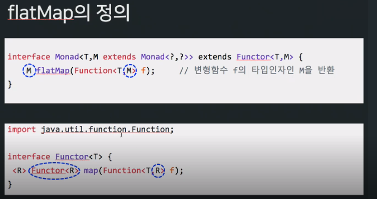

# Chap 05. 함수형 프로그래밍 스터디

## 복잡성을 줄이는 디자인 패턴 

> null 참조는 10억 달러짜리 실수다.

함수매핑이 가능한 단순 자료형을 생성하는 함자라는 개념을 학습합니다. 
다양한 방식으로 에러를 처리하는 로직이 들어 있는 모나드 라는 자료형에 함자를 적용합니다.  

## 명령형 에러 처리의 문제점

명령형 코드는 대부분 try-catch 구문으로 예외처리를 합니다.

### try-catch 에러 처리 

프로그램이 예외를 던지면 자바스크립트 런타임은 실행을 멈추고 문제의 원인을 찾는데 실마리가 될만한 함수 호출 스택을 추적하여 정보를 생성합니다. 

try-catch 를 쓰면 다른 함수와 합성/체이닝을 할 수 없고 코드 설계시 압박을 받을 수 있습니다. 

### 함수형 프로그램은 왜 예외를 던지지 않을까 ?
코드에서 예외를 붙잡아 던지는 방법은 함수형 설계와 잘 맞지 않습니다.

- 함수형 장치처럼 합성이나 체이닝을 할 수 없습니다.
- 예측가능한 값을 지향하는 참조 투명성 원리에 위배됩니다.
- 스택이 풀리면 함수 호출 범위를 벗어나 전체 시스템에 영향을 미치는 부소효과를 일으킵니다.
- 에러를 조치하는 코드가 함수를 호출한 지점과 동떨어져 있기 떄문에 비지역성 원리에 위배됩니다.
- 다양한 에러 조건을 처리하는 블록들이 중첩되어 사용하기 어렵습니다.

### 함자

함수형 에러 처리는 다른 방법으로 접근해 소프트웨어 시스템의 난관을 해결합니다. 
아이디어는 잠재적으로 위험한 코드 주위에 안전망을 설치하는 것 입니다.
코드를 감싼다는 개념은 try-catch 와 비슷하지만 try-catch 블록을 지울 수 있습니다. 

### 불안전한 값을 감쌈

값을 컨테이너화하는 행위는 함수형 프로그래밍의 기본 디자인 패턴입니다. 
값을 안전하게 다루고 프로그램의 불변성이 지켜지도록 직접적인 접근을 차단하는 것입니다. 
유일한 접근방법은 `연산을 컨테이너에 매핑`하는 것입니다. 

```js
class Wrapper {
  constructor(value) {
    this._value = value
  }

  map(f) {
    return f(this._value)
  }
  toString() {
    return `Wrapper (${this._value})`
  }
}

const wrap = (val) => new Wrapper(val)

const wrappedValue = wrap('Get Functional')
wrappedValue.map(console.log)
```

컨테이너 안에 넣어 보호된 값을 얻고 싶은 코드는 무조건 wrappedValue.map 을 통해야만 합니다. 

하지만 null 이나 undefined 면 현재의 호출자는 처리를 할 수 없습니다.

map 을 변형한 fmap 함수를 추가하겠습니다.

```js
fmap(f) {
  return new Wrapper(f(this._value))
}
```

### 함자의 세계로
함자는 값을 래퍼 안으로 승급한 다음 수정하고 다시 래퍼에 넣을 목적을 염두에 둔 함수 매핑이 가능한 자료구조입니다.

fmap 함수는 함수 A -> B 와 함자 Wrapper (A) 를 받아 새로운 함자 Wrapper (B) 를 반환합니다. 
fmap 은 호출할 때마다 컨테이너를 새로 복사 후 반환하는 불변 연산을 수행합니다.

2 + 5 = 5 덧셈을 함수라도 풀어보겠습니다.

```js
const plus = R.curry((a, b) => a + b)
const plus3 = plus(3);

const two = wrap(2);
const five = two.fmap(plus3)
five.map(R.identity); // 5

two.fmap(plus3).fmap(plus10); // Wrapper 15
```

함자 역시 몇가지 중요한 전제 조건이 있습니다.

- 부수효과가 없어야 합니다.
- 합성이 가능해야 합니다.

콘텍스트를 생성 또는 추상하여 원본 값을 바꾸지 앟은 상태로 안전하게 값을 꺼내어 연산을 수행하는 것이 함자의 존재 이유입니다.

함자는 한 형식의 함수를 다른 형식의 함수로 매핑합니다. 
모나드는 매끄럽게 함수 합성을 가능케합니다. 함자가 건드리는 컨테이너가 모나드입니다.
모나드의 주목적은 어떤 자원을 추상화하여 그 속에 든 데이터를 안전하게 처리하는 것 입니다.

```js
$('div').fadeIn(3000).text(student.fullname())
```

fadeIn, text 라는 변환 작업을 제이쿼리가 안전하게 담당하므로 이 코드역시 모나드와 작동 원리는 같습니다. 
찾는 div 가 없더라도 예외를 던지는 것이아니라 빈 제이쿼리 객체에 메서드를 적용하므로 얌전하게 실패합니다.

## 모나드를 응용한 함수형 에러 처리

함자의 문제점을 먼저 살펴보겠습니다. 함자는 한 형식의 함수를 다른 형식의 함수로 매핑합니다. 

```js
const findStudent = R.curry((db, ssn) => wrap(find(db, ssn)))
const getAddress = student => wrap(student.fmap(R.props('address')))
const studentAddress = R.compose(getAddress, findStudent(DB('student')))

studentAddress('444-44-4444') // wrapper(wrapper(address))
studentAddress('444-44-4444').map(R.identity).map(R.identity)
```



## 모나드: 제어 흐름에서 데이터 흐름으로 

함자는 감싼 값에 함수를 적용합니다. 
```js
Wrapper(2).fmap(half) // wrapper(1)
Wrapper(3).fmap(half) // wrapper(1.5)
```

짝수에만 함수를 적용하고 싶다면 어떻게 해야될까요 ? 함자는 주어진 함수를 그대로 적용하고 결과를 래퍼에 감싸주는 역할만 합니다. 

```js
class Empty {
  map(f) {
    return this;
  }
  fmap(_) {
    return new Empty()
  }
  toString() {
    return 'Empty ()'
  }
}
const empty = () => new Empty()

const isEven = (n) => Number.isFinite(n) && (n % 2 === 0)
const half = (val) => isEven(val) ? wrap(val / 2) : empty()

half(4)
half(3) // empty
```

어떤 규칙을 정해 통제한다는 생각으로 자료형을 생성하는 것이 모나드입니다. 
함자처럼 모나드도 자신의 상대가 `어떤 값인지는 전혀 모른채, 일련의 단계로 계산 과정을 서술하는 디자인 패턴입니다.`

```js
half(4).fmap(plus3) // wrapper 5
half(3).fmap(plus3) // empty
```

- 모나드: 모나드 연산을 추상한 인터페이스를 제공
- 모나드형: 모나드 인터페이스를 실제로 구현한 형식 

모나드는 다음과 같은 인터페이스를 준수해야 합니다.

- 형식 생성자: 모나드형을 생성합니다.
- 단위 함수: 어떤 형식의 값을 모나드에 삽입합니다. of 라고 명명합니다.
- 바인드 함수: 연산을 서로 체이닝 합니다. (함자의 fmap 과 같은) flatMap 이라고도 합니다. 
- 조인 연산: 마노다 자료구조의 계층을 폅니다. 다중합성시 중요합니다.

```js
class Wrapper {
  constructor(value){ // 형식 생성자
    this._value = value 
  }
  static of(a) { // 단위 함수
    return new Wrapper(a)
  }
  map(f) { // 바인드 함수
    return Wrapper.of(f(this._value))
  }
  join(){
    if(!(this._value instanceof Wrapper)) {
      return this
    }
    return this._value.join()
  }
  get() {
    return this._value
  }
  toString() {
    return `Wrapper (${this._value})`
  }
}
```

Wrapper 는 데이터를 외부와 완전히 단절시킨 채 부수효과 없이 다루기 위한 함자입니다.

```js
Wrapper.of('Hello').map(R.toUpper).map(R.identity)
```

map 은 주어진 함수를 매핍하고 컨테이너의 대문을 닫는 일이 전부인 중립 함수자 입니다.
join 은 중접된 구조를 펴주는 함수입니다.

```js
// findObject :: DB -> String -> Wrapper
const findObject = R.curry((db, id) => Wrapper.of(find(db, id)))

// getAddress :: Student -> Warpper
const getAddress = student => Wrapper.of(student.map(R.props('address')))

const studentAddress = R.compose(getAddress, findObject(DB('student')))

studentAddress('444-44-4444').join().get() // 주소
```

```js
Wrapper.of(Wrapper.of(Wrapper.of('Get Functional'))).join() // Wrapper('Get Functional')
```

## Maybe 와 Either 모나드로 에러를 처리 
모나드는 null 이나 undefined 를 모형화할 수 있습니다. 함수형 프로그래밍에서는 Maybe, Tither 형으로 에러를 구상화하여 아래의 일들을 처리합니다.

- 불순 코드를 격리 
- null 체크 로직을 정리
- 예외를 던지지 않음
- 함수 합성을 지원
- 기본값 제공 로직은 한곳에 모음 

### null 체크를 Maybe 로 일원화

Maybe 모나드는 Just, Nothing 두 하위형으로 구성된 빈 형식으로써 주 `목적은 null 체크 로직을 효과적으로 통합`하는 것입니다.

- just (value): 존재하는 값을 감싼 컨테이너
- Nothing(): 값이 없는 컨테이너, 또는 추가 정보 없이 실패한 컨테이너, 추가적인 함수 적용이 가능합니다.

```js
class Maybe {
  static just(a) {
    return new Just(a)
  }
  static Nothing() {
    return new Nothing()
  }
  static fromNullable(a) {
    return a !== null ? Maybe.just(a) : Maybe.nothing()
  }
  static of (a) {
    return just(a)
  }
  get isNothing(){ 
    return false
  }
  get isJust() {
    return false;
  }
}

class Just extends Maybe {
  constructor(value) {
    super()
    this._value = value
  }
  get value() {
    return this._value
  }
  map(f) {
    return Maybe.fromNullable(f(this._value))
  }
  getOrElse() {
    return this._value // 자료구조 값을 추출
  }
  filter(f) {
    Maybe.fromNullable(f(this._value) ? this._value : null)
  }
  chain(f) {
    return f(this._value)
  }
  toString() {
    return `Maybe.just(${this._value})`
  }
}

class Nothing extends Maybe {
  map(f) {
    return this
  }
  get value(){
    throw new TypeError('Nothing 값을 가져올 수 없습니다.')
  }
  getOrElse(other){
    return other // 자료 구조 값을 무시하고 무조건 other 을 반환
  }
  filter(f) {
    return this._value 
  }
  chain(f) {
    return this
  }
  toString(){
    return 'Maybe.Nothing'
  }
}
```

Maybe 는 널 허용값을 다루는 작업을 명시적으로 추상하여 개발자가 비즈니스 로직에 집중 할 수 있도록 도와줍니다.

Maybe 모나드는 DB 쿼리, 컬렉션에서 값을 검색하거나 서버에 데이터를 요청하는 등 결과가 불확실한 호출 할 때 자주 사용합니다. 

```js
// safeFindObject :: DB -> String -> Maybe
const safeFindObject = R.curry((db, id) => Maybe.fromNullable(find(db, id)))

// safeFindStudent :: String -> Maybe(Student)
const safeFindStudent = safeFindObject(DB('student'))
const address = safeFindStudent('444-44-4444').map(R.prop('address'))
address // Just 또는 Nothing 
```

null 체크는 Maybe.fromNullable 이 대신 해주고 호출한 값이 있으면 Just 없으면 Nothing 을 반환합니다. 
Maybe.fromNullable 에 잘못된 값이 넘어오면 Nothing 형이 넘어오고 get() 을 호출하면 예외가 발생합니다.

> Maybe 를 자바 8과 스칼라 언어에서는 Optional 또는 Option 이라고 합니다.

기존의 null check 

```js
if () {} else .........
```

```js
const getCountry = student => student.map(R.prop('school')).map() ..... .getOrElse('존재하지 않는 국가입니다')
```

## Either 로 실패를 복구
Either 는 절대로 동시에 발생하지 않는 두 값 a, b 를 논리적으로 구분한 자료구조 입니다.

- Left(a): 에러 메세지 또는 예외 객체를 담습니다 
- Right(b): 성공한 값을 담습니다.

Either 는 오른쪽 피연산자를 중심으로 작동합니다. 컨테이너에 함수를 매핑하면 항위형 Right 에 적용됩니다.
Either 는 어떤 `계산 도중 실패할 경우 원인에 관한 추가 정보를 결과와 함께 제공할 목적`으로 사용합니다.

```js
class Either {
  constructor(value){ // 예외 또는 정상 값을 가집니다
    this._value = value
  } 
  get value() {
    return this._value 
  }
  static left(a) {
    return new Left(a)
  }
  static right(a) {
    return new Right(a)
  }
  static fromNullable(val) {
    // 값이 올바르면 right 아니면 left 
    return val !== null && val !== undefined ? Either.right(val) : Either.left(val)
  }
  static of(a) {
    return Either.right(a)
  }
}
```

위에서 살펴봤던 safeFindObject 함수에 Either 모나드를 응용하면 아래와 같이 표현이 가능합니다.

```js
const safeFindObject = R.curry((db, id) => {
  const obj = find(db, id)
  if(obj) {
    return Either.of(obj)
  }
  return Either.left('id 객체를 찾을 수 없습니다.')
})
```

데이터가 정상 조회되면 학생 객체는 오른쪽에 저장되고, 그렇지 않으면 왼쪽에 에러메세지가 담깁니다.

## IO 모나드로 외부 자원과 상호작용 
하스켈은 IO 연산을 전적으로 모나드에 의존해 처리하는 특이한 프로그래밍 언어입니다. 

```text
IO.of('불안전한 연산입니다').map(alert)
```

자바스크립트는 DOM 과 상호작용을 해야하므로 읽기든 쓰기든 모든 작업들은 부수효과를 일으키고 참조 투명성에 위배됩니다.

```js
const read = (document, selector) => document.querySelector(selecotr).innerHTML
```

프로세스가 호출 도중 write 를 실행해서 DOM 을 변경하고 그 상태에서 read 를 여러번 호출하면 응답 결과도 그때마다 달라집니다. 

순수코드에서 불순코드를 들어내는 주된 목적은 일관된 결과를 보장하는 것입니다. 
부수효과 문제를 바로잡거나 변이를 막을 순 없지만, 애플리케이션 관점에서 IO 연산이 불변한 것처럼 작동시킬 방법은 있습니다.

```js
class IO {
  constructor(effect) { // IO 모나드는 읽기/쓰기 같은 작업을 effect 함수에 담습니다
    if(!_.isFunction(effect)){ 
      throw 'IO 함수는 필수입니다'
    }
    this.effect = effect
  }
  static of(a){
    return new IO(() => a)
  }
  static from(fn) {
    return new IO(fn)
  }
  map(fn) {
    let self = this
    return new IO(() => fn(self.effect()))
  }
  chain(fn) {
    return fn(this.effect())
  }
  run(){
    return this.effect()
  }
}
```

```js
const read = (document, selector) => {
  () => document.querySelector(selector).innerHTML
}
const write = (document, selector) => {
  return (val) => {
    document.querySelector(selector).innerHTML = val;
  }
}

const readDom = _.partial(read, document)
const writeDom = _.partial(write, document)

const changeToStartCase = IO.from(readDom('#student-name')).map(_.startCase).map(writeDom('#student-name'))
```

## 마치며

- 객체지향 방식으로 예외 처리를 하면 호출자가 try-catch 로직으로 예외를 붙잡아 처리해야 하므로 할 일이 많아진다
- 컨테이너화하는 패턴을 따르면 부수효과 없이 코드를 작성할 수 있습니다
- 모나드는 함수형 프로그래밍의 디자인 패턴으로, 함수간에 데이터가 안전하게 흘러가도록 조정하여 애플리케이션의 복잡도를 낮추는 역할을 합니다.
- Maybe, Either, IO 등의 모나드형을 교차 배치하면 탄력적으로 함수를 합성할 수 있습니다.

## 동영상

모나드는 언제 필요한가 ? 
- 비동기 연산 처리 Promise 는 모나드의 일종이다
- Null 처리

Monade 는 

- 값을 담는 컨테이너의 일종
- Funtor 를 기반으로 구현되어있다
- flatMap 메서드를 제공
- Monad Laws 를 만족시키는 구현체를 말한다. 

Functor 란 ?

1. 함수를 인자로 받는 map 메서드만 가진다 
2. 타입인자 <T> 를 가진다
3. 전달인자인 함수 f 는 <T> 타입을 받아서 <R> 타입 값을 반화하는 함수 
4. Functor 는 map 함수를 거쳐 <R> 타입의 값을 리턴한다

```text
Functor<String>    Int stringToInt(String args) === Function<String, Int> f 
```

map 은 리스트를 순회하는 임무가아닌
<T> 타입의 Functor 를 <R> 타입의 Functor 로 바꾸는 기능

Functor 를 이용하여

- 값이 없는 케이스
- 값이 미래에 준비될 것으로 예상되는 케이스 등을 처리할 수 있다 
- 함수 합성을 손쉽게 할 수 있다

Monad 는 Functor 에 fMap 을 추가한 것 

Functor 의 문제점

- Functor 가 Functor 로 감싸져 있으면, 함수의 합성과 체이닝을 저해한다.


# 참고자료 

- https://tv.naver.com/v/5340169

# ETC FP 자료 모음

- https://github.com/stoeffel/awesome-fp-js
- https://flaviocopes.com/javascript-functional-programming/