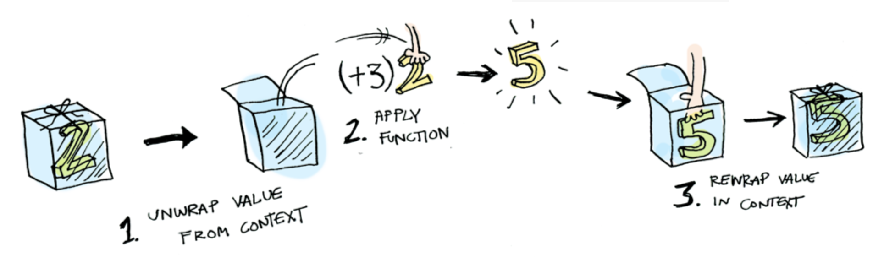

> # 꿀단지 찾기
>
> ## [Functional Programming Workshop Github 저장소](https://github.com/timoxley/functional-javascript-workshop)
>
> - 문제에 따라 솔루션을 작성하고 verify 할 수 있도록 프로그램이 만들어져 있음.
>
> ## [functional Programming Problems PDF](http://www.courses.coreservlets.com/Course-Materials/pdf/javascript/exercises/exercises-javascript-functions.pdf)
>
> - basic : 4문제, advanced : 3문제
> - 단점은 답이 없다.

# Chapter 5. 복잡성을 줄이는 디자인 패턴

### wrote by. robin

## 5.1 명령형 에러 처리의 문제점

- 프로그램 실행 중 예외가 나거나 네트워크 연결이 끊기는 등의 문제로 인해 데이터가 `null`, `undefined`로 값이 설정됨.
- 이런 에러 상황을 대비하기 위해, 에러가 날 만한 곳에 `null` 체크문을 넣는다. => 코드의 복잡성 증가
- 명령형 코드는 대부분 try-catch 구문으로 예외 처리를 한다.

### try-catch 에러 처리

- `try-catch` 구문으로 예외를 붙잡아 던지는 방식이 보편적이다.

```javascript
try {
  //예외가 날 가능성이 있는 코드 : 위험한 코드를 둘러싼다.
} catch (e) {
  //예외를 처리하는 구문
  console.log("error: ", e.message);
}
```

- 안전하지 않은 코드 부분(=에러가 날 가능성이 있다.)을 try 블록으로 감싼 형태이다.
- 예외가 발생하면, 자바스크립트 런타임은 실행을 멈추고 문제의 원인을 찾는 데 실마리가 될 정보를 알려준다.
- 루프와 조건문을 함수로 추상했던 것처럼 에러 처리도 추상할 필요가 있다.
  - 함수에 `try-catch`를 쓰면 다른 함수와 합성/체이닝을 할 수 없다.
  - 코드 설계시 압박을 받는다.

### 함수형 프로그래밍은 왜 예외를 던지지 않을까?

- 예외를 던지는 함수의 특징
  - 다른 함수형 장치처럼 합성이나 체이닝을 할 수 없다.
  - 참조 투명성 원리에 위배 - (예외 발생 시) 단일한, 예측가능한 값이 아니다.
  - **[?]부수 효과를 일으킴** - 예기치 않게 스택이 풀리면 함수 호출 범위를 벗어나 전체 시스템에 영향을 미친다.
  - 비지역성 원리에 위배 - 에러시 조치하는 코드가 함수를 호출한 지점과 떨어져 있다.
  - 다양한 에러 조건을 처리하는 블룩들이 중첩되어 사용하기 어렵다.

### null 체크라는 고질병

다음장에서 함자 설명을 위한 밑밥.

## 5.2 더 나은 방안 : 함자

- 명령형과 차이점은, 위험한 코드를 감싼다는 개념은 그대로 가져가되, try-catch 블록은 제거할 수 있다.

### 불안전한 값을 감쌈

- 값을 컨테이너화 => 에러가 날지도 모르는 값을 Wrapper 객체로 감싼다.
- 값을 안전하게 다루고 프로그램의 불변성이 지켜지도록 직접적인 접근을 차단하는 것
  - 감싼 값에 유일하게 접근하는 방법 => 연산을 컨테이너에 매핑

```javascript
class Wrapper {
  //value값을 저장한다.
  constructor(value) {
    this.value = value;
  }

  //주어진 함수를 매핑한다.
  map(f) {
    return f(this.value);
  }

  fmap(f) {
    return new Wrapper(f(this.value));
  }
}

//값을 Wrapper 감싸주는 helper 함수
const wrap = val => new Wrapper(val);

const wrapedValue = wrap("Get Functional");
// 무조건 Wrapper.map을 이용해서만 컨테이너 내부의 값에 접근할 수 있다.
wrapedValue.map(console.log); //"Get Functional"

const wrappedNull = wrap(null);
//map과 다르게, 컨테이너를 새로 복사한 후 반환한다. => 불면성
wrappedNull.fmap(doWork).fmap(console.log); //false

//Null 이면 true 반환, 아니면 value 반환
function doWork(value) {
  return value === null ? false : value;
}
```

- **용어가 혼용 되어 있어, 혼란스럽다.**
  - Wrapper(컨테이너를 구현한 클래스 이름) 객제,
  - **컨테이너 / 컨텍스트는 혼용해서 사용해도 되는 건지?**

### `Functor`(함자)의 세계로

> ### A functor is a function, given a value and a function, does the right thing.
>
> ### To be more specific.
>
> A functor is a function, given a value and a function, unwraps the values to get to its inner value(s), calls the given function with the inner value(s), wraps the returned values in a new structure, and returns the new structure.
> 

- 체이닝이 가능한 이유 : fmap이 같은 형식을 반환하기 때문에 => 같은 형식의 컨테이너로 겨려과를 감싸기 때문에
- 함수자의 전제 조건

  - 부수효과가 없어야 한다. : 콘텍스트에 R.identity 함수를 매핑하면 동일한 값을 얻는다. => 함자가 부수효과 없이 감싼 값의 자료구조를 그대로 유지한다는 증거이다.

  ```javascript
  wrap("Get Functional").fmap(R.identity); //-> Wrapper('Get Functional')
  ```

  - 합성이 가능해야 한다. : 합성함수에 fmap을 적용한 것과 famp 함수를 함께 체이닝한 것이 동일하다는 뜻이다.

  ```javascript
  const two = wrap(2);
  two.fmap(plus3).fmap(R.tap(infoLogger)); //-> Wrapper(5)

  two
    .fmap(
      R.compose(
        plus3,
        R.tap(infoLogger)
      )
    )
    .map(R.identity); //-> 5
  ```

- 쫄지마라. 당신은 이미 모나드를 경험했다.
  - 함수자가 건드리는 컨테이너가 모나드이다.
  - jQuery
  - 모나드의 주목적은 어떤 자원이든 추상하여 그 속에 든 데이터를 안전하게 처리하는 것이다.

## 5.3 모나드를 응용한 함수형 에러 처리

- 함수자 사용의 한게점?
  - 에러 처리 코드를 추상할 수 있지만, 합성이 일어났을 때 실행 결과가 예상과 다름 수 있다. => Wrapper로 감싼 객체가 이중, 또는 삼중으로 감싸진 채로 반환될 수 있다. => 데이터에 접근 하기가 까다로워 진다.
- 함수자 사용의 한계점 해결 => 모나드

### 모나드: 제어 흐름에서 데이터 흐름으로

- 모나드 : 모나드 연산을 추상한 인터페이스를 제공한다.
- 모나드형(`monadic type`) : 모나드 인터페이스를 실제로 구현한 형식이다.
  1. 형식 생성자(`type constructor`) : 모나드형을 생성한다. (Wrapper 생성자와 비슷)
  2. 단위 함수(`unit function`) : 어떤 형식의 값을 모나드에 삽입한다. 방금 전 wrap, empty 함수와 비슷하지만, 모나드에서는 `of`라고 함수를 명명한다.
  3. 바인드 함수(`bind function`) : 연산을 서로 체이닝한다. (함자의 fmap에 해당하며, flatMap이라고도 한다.)
  4. 조인 연산(`join operation`) : 모나드 자료구조의 계층을 평탄화한다. 모나드 반환 함수를 다중 합성할 때 중요하다.

```javascript
class Wrapper {
  // 1.형식 생성자
  constructor(value) {
    this._value = value;
  }

  // 2.단위 함수
  static of(a) {
    return new Wrapper(a);
  }

  // 3.바인드 함수 - 함자
  // 주어진 함수를 매핑하고 컨테이너의 문을 닫는 일을 한다. - 중립 함수자
  map(f) {
    return Wrapper.of(f(this._value));
  }

  // 4.조인 연산 : 중첩된 계층을 평탄화 한다. => Wrapper가 중첩되었던 함자 문제 해결
  join() {
    if (!(this._value instanceof Wrapper)) {
      return this._value;
    }
    return this._value.join();
  }

  get() {
    return this._value;
  }

  //자료 구조를 나타낸 문자열 반환
  toString() {
    return `Wrapper (${this._value})`;
  }
}
```

### `Maybe`와 `Either` 모나드로 에러를 처리

- 모나드는 유효하지 않은 값(`null`, `undefined`)
  - 불순 코드 격리
  - `null` 체크 로직 정리
  - 예외를 던지지 않음
  - 함수 합성 지원
  - 기본값 셋팅 로직을 한곳에 모음

### null 체크를 Maybe로 일원화

- `null` 체크 로직 통합
  - `Just(value)` : 존재하는 값을 값싼 컨테이너
  - `Nothing()` : 값이 없는 컨테이너. `Nothing`값에도 함수를 적용할 수 있다.
- Java8 / Scala에서는 `maybe`를 `optional`로 지칭한다. `Just`는 `Some`, `Nothing`은 `None`으로 각각 대응된다.

```javascript
```

### Either로 실패를 복구

- 절대로 동시에 발생하지 않는 두 값 a,b를 논리적으로 구분한 자료구조이다.
  - `Left(a)` : 에러 메시지 또는 예외 객체를 담는다.
  - `Right(b)` : 성공한 값을 담는다.
- 오른쪽 피연산자를 중심으로 작동한다.
- 어떤 계산 도중 실패했을 때, 그 원인에 대한 추가 정보를 결과와 함께 나타낸다.

```javascript
```

### IO 모나드로 외부 자원과 상호작용

- DOM에 하는 모든 작업들은 부수효과를 일으키고 참조 투명성에 위배된다.
- 일관된 결과가 보장되지 않는다. => 해결 방법 - 모나드 체인으로 데이터 흐름을 모나드가 주도하게 한다.

```javascript
```

## 5.4 모나드 체인 및 합성

- 모나드는 부수효과를 억제하므로 합성 가능한 자료구조로 활용할 수 있다.
- 함수 간에 대이터가 안전하게 흘러가도록 조정하여 애플리케이션의 복잡도를 낮추는 역할을 한다.

```javascript
//함수형 프로그래밍 ver.
const getOrElse = R.curry((message, container) => container.getOrElse(message));

const showStudent = R.compose(
  map(append("#student-info")),
  liftIO,
  getOrElse("학생을 찾을 수 없습니다."),
  map(csv),
  map(r.props(["ssn", "firstname", "lastname"])),
  chain(findStudnet),
  chain(checkLengthSsn),
  lift(cleanInput)
);

//비함수형 ver.
function showStudent2() {
  if (ssn != null) {
    ssn = ssn.reploace("...");
    if (ssn.length !== 9) {
      throw new Error("잘못된 입력입니다.");
    }
    let student = db.get(ssn);
    if (student) {
      document.querySelector(`#${elementId}`).innerHTML = `${student.ssn},
      ${student.firstname},
      ${student.lastname}`;
    } else {
      throw new Error("학생을 찾을 수 없습니다.");
    }
  } else {
    throw new Error("잘못된 ssn입니다.");
  }
}
```

> # Reference
>
> ## [What is a functor](https://medium.com/@dtinth/what-is-a-functor-dcf510b098b6)
>
> ## [Functor](http://functionaljavascript.blogspot.com/2013/07/functors.html)
>
> ## [Functors, Applicatives, And Monads In Pictures](http://adit.io/posts/2013-04-17-functors,_applicatives,_and_monads_in_pictures.html#functors)
>
> ## [번역 - Functors, Applicatives, And Monads In Pictures](https://lazyswamp.tistory.com/entry/functorsapplicativesandmonadsinpictures)
